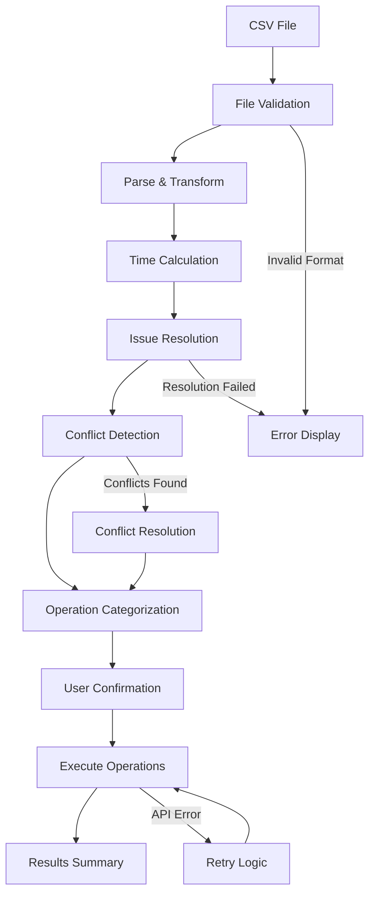
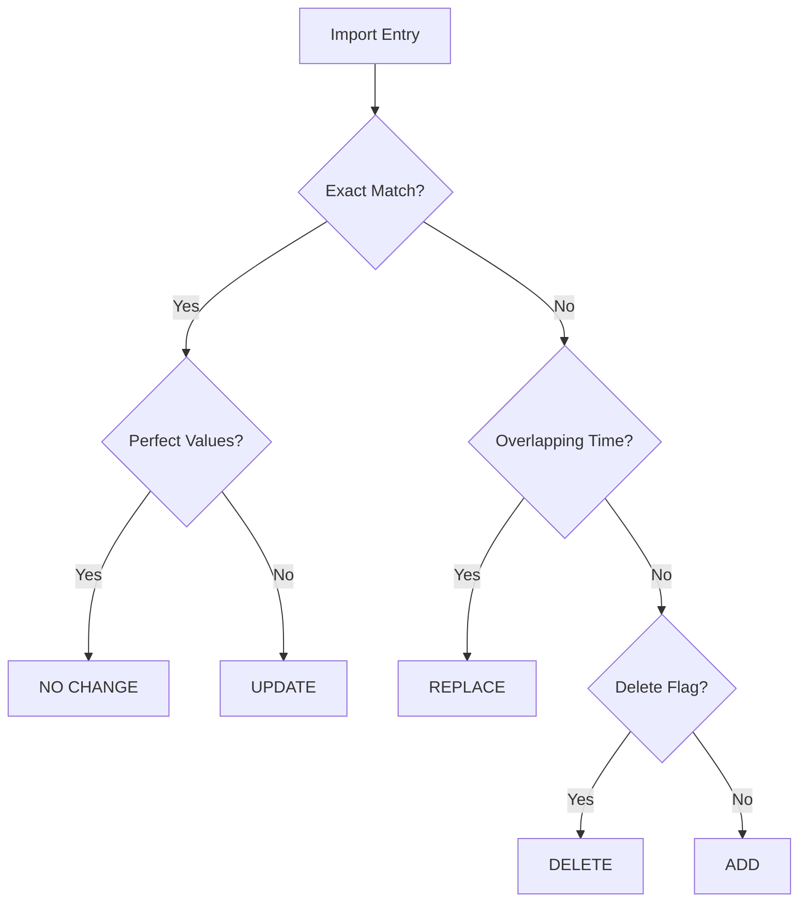

# Tempo Time Tracking CLI - Solution Design & Implementation Plan

## 🎯 Solution Overview

This document outlines the detailed design and implementation strategy for the Tempo Time Tracking CLI application. The solution addresses the need for efficient bulk time entry management with intelligent conflict resolution and data integrity validation.

## 🏛️ System Architecture Design

### Layered Architecture Pattern
```
┌─────────────────────────────────────────────────────────────┐
│                    PRESENTATION LAYER                       │
├─────────────────────────────────────────────────────────────┤
│  CLI Interface  │  Interactive Menus  │  Progress Display   │
│  • inquirer.js  │  • Input validation │  • chalk/colors    │
│  • File I/O     │  • Error display    │  • Progress bars   │
└─────────────────────────────────────────────────────────────┘
                                │
┌─────────────────────────────────────────────────────────────┐
│                   BUSINESS LOGIC LAYER                      │
├─────────────────────────────────────────────────────────────┤
│ TimeTrackingController │ ValidationEngine │ ConflictResolver │
│ • Import orchestration │ • Time conflicts │ • Priority rules │
│ • Operation planning   │ • Data integrity │ • Smart merging  │
│ • Progress tracking    │ • CSV validation │ • Duplicate mgmt │
└─────────────────────────────────────────────────────────────┘
                                │
┌─────────────────────────────────────────────────────────────┐
│                     SERVICE LAYER                           │
├─────────────────────────────────────────────────────────────┤
│  TempoAPIService   │  MCPJiraService   │  FileHandlerService │
│  • CRUD operations │  • Issue lookup   │  • CSV parsing     │
│  • Rate limiting   │  • Permission val │  • Data transform  │
│  • Error handling  │  • Fallback logic │  • Format validation│
└─────────────────────────────────────────────────────────────┘
                                │
┌─────────────────────────────────────────────────────────────┐
│                      DATA LAYER                             │
├─────────────────────────────────────────────────────────────┤
│   Data Models      │   Utilities       │   Configuration    │
│   • Worklog        │   • Time calc     │   • API settings   │
│   • TimeRange      │   • Validation    │   • User prefs     │
│   • Operation      │   • Transformation│   • Credentials    │
└─────────────────────────────────────────────────────────────┘
```

## 📁 File Structure & Organization

### Project Structure
```
tempo-time-tracker/
├── src/
│   ├── controllers/
│   │   └── timeTrackingController.js     # Main orchestration logic
│   ├── services/
│   │   ├── tempoApiService.js           # Tempo API integration
│   │   ├── mcpJiraService.js            # MCP JIRA service
│   │   └── fileHandler.js               # File processing
│   ├── models/
│   │   ├── Worklog.js                   # Worklog data model
│   │   ├── TimeRange.js                 # Time calculation model
│   │   └── Operation.js                 # Operation tracking
│   ├── utils/
│   │   ├── config.js                    # Configuration management
│   │   ├── timeUtils.js                 # Time calculation utilities
│   │   ├── validation.js                # Data validation functions
│   │   └── logger.js                    # Logging utilities
│   └── index.js                         # Main entry point
├── tests/
│   ├── unit/                            # Unit tests
│   ├── integration/                     # Integration tests
│   └── fixtures/                        # Test data files
├── docs/                                # Documentation
├── logs/                                # Application logs
├── .env.example                         # Environment template
├── package.json                         # Dependencies
└── README.md                            # Project overview
```

## 🔄 Data Flow Architecture

### Import Process Flow


### Operation Classification Logic


## 🧩 Core Components Design

### 1. TimeTrackingController (Main Orchestrator)

**Purpose:** Central coordination of all time tracking operations

**Key Methods:**
```javascript
class TimeTrackingController {
  // Main import workflow
  async importWorklogs(filePath, dryRun = false, dateFilter = null) {
    // 1. Parse CSV file
    // 2. Validate data integrity
    // 3. Fetch existing worklogs
    // 4. Detect conflicts and categorize operations
    // 5. Execute operations with progress tracking
    // 6. Generate summary report
  }

  // Enhanced validation with conflict detection
  async validateTimeConflicts(worklogs) {
    // Internal CSV validation
    // Cross-reference with existing data
    // Generate conflict reports
  }

  // Smart operation categorization
  async categorizeWorklogOperations(imports, existing, authorId) {
    // Exact matching logic
    // Conflict detection
    // Priority-based resolution
    // Operation classification
  }
}
```

**Design Patterns:**
- **Command Pattern:** Each operation type (ADD, UPDATE, DELETE, REPLACE) as command objects
- **Strategy Pattern:** Different conflict resolution strategies
- **Observer Pattern:** Progress reporting during long operations

### 2. TempoAPIService (API Integration)

**Purpose:** Handle all Tempo API communications with resilience

**Key Features:**
```javascript
class TempoAPIService {
  constructor() {
    this.apiClient = axios.create({
      baseURL: config.tempoBaseUrl,
      timeout: 30000,
      headers: { 'Authorization': `Bearer ${config.tempoApiToken}` }
    });
    
    // Rate limiting implementation
    this.rateLimiter = new RateLimiter(300); // 300ms between calls
  }

  // Enhanced worklog creation with MCP integration
  async createWorklogWithMCP(issueKey, hours, startDate, startTime, description) {
    // 1. Resolve issue using MCP
    // 2. Build API payload
    // 3. Execute with retry logic
    // 4. Handle rate limiting
  }

  // Intelligent data filtering
  async getWorklogs(params = {}) {
    // 1. Apply automatic date filtering (avoid old data)
    // 2. Exclude system worklogs (__tempo-io__unknown_user)
    // 3. Expand author and issue details
    // 4. Handle pagination
  }
}
```

**Resilience Patterns:**
- **Circuit Breaker:** Stop calling failing APIs temporarily
- **Retry with Exponential Backoff:** Progressive retry delays
- **Rate Limiting:** Respect API constraints
- **Timeout Handling:** Prevent hanging requests

### 3. MCPJiraService (Issue Resolution)

**Purpose:** Resolve JIRA issue keys to internal IDs using MCP

**Implementation Strategy:**
```javascript
class MCPJiraService {
  constructor() {
    this.knownMappings = new Map(); // Cache for performance
    this.mcpClient = new MCPClient(config.mcpEndpoint);
  }

  async getIssueDetails(issueKey) {
    // 1. Check cache first
    // 2. Query known mappings
    // 3. Fall back to MCP lookup
    // 4. Handle resolution failures
    return { id, key, summary };
  }

  // Batch issue resolution for performance
  async resolveMultipleIssues(issueKeys) {
    // Process in batches to optimize MCP calls
  }
}
```

## 🎛️ Configuration Management

### Environment Configuration
```javascript
// config.js - Centralized configuration management
module.exports = {
  tempo: {
    baseUrl: process.env.TEMPO_BASE_URL || 'https://api.tempo.io/4/',
    apiToken: process.env.TEMPO_API_TOKEN,
    rateLimitMs: parseInt(process.env.RATE_LIMIT_MS) || 300,
    timeout: parseInt(process.env.API_TIMEOUT) || 30000
  },
  
  mcp: {
    endpoint: process.env.MCP_ENDPOINT,
    timeout: parseInt(process.env.MCP_TIMEOUT) || 10000
  },
  
  user: {
    accountId: process.env.USER_ACCOUNT_ID || '712020:xxxxxxxx-xxxx-xxxx-xxxx-xxxxxxxxxxxx',
    timezone: process.env.TIMEZONE || 'UTC'
  },
  
  performance: {
    maxConcurrentRequests: parseInt(process.env.MAX_CONCURRENT) || 10,
    chunkSize: parseInt(process.env.CHUNK_SIZE) || 50,
    memoryLimit: parseInt(process.env.MEMORY_LIMIT_MB) || 512
  }
};
```

## 🛠️ Implementation Strategy

### Phase 1: Core Infrastructure (✅ Completed)
**Timeline:** Week 1-2  
**Deliverables:**
- Basic project structure and dependencies
- Core data models (Worklog, TimeRange)
- Basic CSV parsing and file handling
- Initial Tempo API integration

**Key Implementations:**
```javascript
// Basic worklog model with validation
class Worklog {
  constructor(data) {
    this.startDate = data.date;
    this.startTime = data.startTime;
    this.endTime = data.endTime;
    this.issueKey = data.issue;
    this.description = data.description;
    this.hours = this.calculateHours();
  }
  
  calculateHours() {
    // Time range to hours conversion
  }
  
  validate() {
    // Data validation rules
  }
}
```

### Phase 2: Enhanced Validation (✅ Completed)
**Timeline:** Week 3-4  
**Deliverables:**
- Time conflict detection engine
- MCP integration for issue resolution
- Advanced CSV validation
- Duplicate detection logic

**Key Implementations:**
```javascript
// Conflict detection algorithm
validateTimeConflicts(worklogs) {
  const conflicts = [];
  for (let i = 0; i < worklogs.length; i++) {
    for (let j = i + 1; j < worklogs.length; j++) {
      if (this.hasTimeOverlap(worklogs[i], worklogs[j])) {
        conflicts.push({ entry1: worklogs[i], entry2: worklogs[j] });
      }
    }
  }
  return conflicts;
}
```

### Phase 3: Smart Operations (✅ Completed) 
**Timeline:** Week 5-6  
**Deliverables:**
- Operation categorization (ADD/UPDATE/DELETE/REPLACE)
- Priority-based conflict resolution
- Exact matching validation
- Performance optimizations

**Key Implementations:**
```javascript
// Perfect match validation
isPerfectMatch(importWL, existingWL) {
  return (
    importWL.hours === existingWL.timeSpentSeconds / 3600 &&
    importWL.description === existingWL.description &&
    importWL.startTime === existingWL.startTime &&
    importWL.startDate === existingWL.startDate &&
    importWL.issueKey === this.extractIssueKey(existingWL)
  );
}
```

### Phase 4: Performance & Polish (✅ Completed)
**Timeline:** Week 7-8  
**Deliverables:**
- System worklog filtering
- Aggressive performance optimizations
- Enhanced error handling
- Comprehensive logging

**Key Implementations:**
```javascript
// System worklog filtering
filterWorklogs(worklogs, authorAccountId) {
  return worklogs.filter(w => {
    // Exclude system worklogs
    if (w.author?.accountId === "__tempo-io__unknown_user") {
      return false;
    }
    
    // Apply date and permission filters
    return this.isActionableWorklog(w, authorAccountId);
  });
}
```

## 🔄 Algorithm Design

### Conflict Resolution Algorithm
```javascript
class ConflictResolver {
  resolve(importEntry, conflictingEntries) {
    const strategy = this.determineStrategy(importEntry, conflictingEntries);
    
    switch (strategy) {
      case 'REPLACE_ALL':
        return {
          operation: 'REPLACE',
          toDelete: conflictingEntries,
          toCreate: importEntry
        };
        
      case 'UPDATE_EXISTING':
        const target = this.findBestMatch(importEntry, conflictingEntries);
        return {
          operation: 'UPDATE',
          target: target,
          changes: this.calculateChanges(importEntry, target)
        };
        
      case 'SKIP_IMPORT':
        return { operation: 'NO_CHANGE' };
    }
  }
  
  determineStrategy(importEntry, conflicts) {
    // Priority rules:
    // 1. Import data always wins for exact matches
    // 2. Replace conflicting time ranges
    // 3. Skip if perfect match exists
  }
}
```

### Performance Optimization Strategies

#### 1. Data Filtering Pipeline
```javascript
const optimizationPipeline = [
  // Stage 1: Server-side filtering
  (params) => ({
    ...params,
    from: '2025-01-01', // Avoid old data
    expand: 'author,issue'
  }),
  
  // Stage 2: Client-side filtering  
  (worklogs) => worklogs.filter(w => 
    w.author?.accountId !== "__tempo-io__unknown_user"
  ),
  
  // Stage 3: Permission-based filtering
  (worklogs, authorId) => worklogs.filter(w =>
    w.author?.accountId === authorId || 
    w.startDate >= recentCutoff
  )
];
```

#### 2. API Rate Limiting
```javascript
class RateLimiter {
  constructor(intervalMs) {
    this.interval = intervalMs;
    this.lastCall = 0;
  }
  
  async wait() {
    const elapsed = Date.now() - this.lastCall;
    if (elapsed < this.interval) {
      await new Promise(resolve => 
        setTimeout(resolve, this.interval - elapsed)
      );
    }
    this.lastCall = Date.now();
  }
}
```

## 🧪 Testing Strategy

### Unit Testing Approach
```javascript
// Example test structure
describe('TimeTrackingController', () => {
  describe('validateTimeConflicts', () => {
    test('should detect overlapping time ranges', () => {
      const worklogs = [
        { startDate: '2025-08-25', startTime: '09:00:00', endTime: '11:00:00' },
        { startDate: '2025-08-25', startTime: '10:00:00', endTime: '12:00:00' }
      ];
      
      const conflicts = controller.validateTimeConflicts(worklogs);
      expect(conflicts).toHaveLength(1);
    });
  });
});
```

### Integration Testing Strategy
- **API Integration:** Mock external services with realistic responses
- **File Processing:** Test with various CSV formats and edge cases
- **End-to-End:** Complete workflow testing with sample data
- **Performance:** Load testing with large datasets

## 📊 Monitoring & Observability

### Logging Strategy
```javascript
const logger = {
  levels: ['debug', 'info', 'warn', 'error'],
  
  info(message, data = {}) {
    console.log(chalk.blue(`[INFO] ${message}`), data);
    this.writeToFile('info', message, data);
  },
  
  error(message, error = null) {
    console.error(chalk.red(`[ERROR] ${message}`));
    if (error) console.error(error.stack);
    this.writeToFile('error', message, { error: error?.message, stack: error?.stack });
  }
};
```

### Performance Metrics
- **Import Duration:** Time to process N worklogs
- **API Success Rate:** Percentage of successful API calls
- **Memory Usage:** Peak memory consumption during imports
- **Conflict Resolution Rate:** Percentage of conflicts resolved automatically

## 🚀 Deployment Strategy

### Local Installation
```bash
# Development setup
git clone <repository>
cd tempo-time-tracker
npm install
cp .env.example .env
# Configure .env with API tokens
npm test
npm start
```

### Production Deployment
```bash
# Global installation
npm install -g tempo-time-tracker-cli
tempo-cli --version

# Or local binary
npx tempo-time-tracker
```

## 🔄 Future Enhancements

### Planned Features (Phase 5+)
1. **Configuration UI:** Web-based configuration management
2. **Batch Processing:** Multiple file imports with queuing
3. **Advanced Reporting:** Analytics and time utilization insights
4. **Plugin Architecture:** Extensible validation and transformation rules
5. **Real-time Sync:** Watch CSV files for changes and auto-import

### Technical Debt & Improvements
1. **TypeScript Migration:** Add type safety and better IDE support
2. **Database Integration:** Local SQLite for caching and offline work
3. **GraphQL Integration:** More efficient data fetching
4. **Microservice Architecture:** Separate concerns for scalability

---

**Document Version:** 1.0  
**Implementation Status:** ✅ Production Ready  
**Last Updated:** August 28, 2025  
**Architecture Review:** Completed  
**Performance Validation:** ✅ Passed